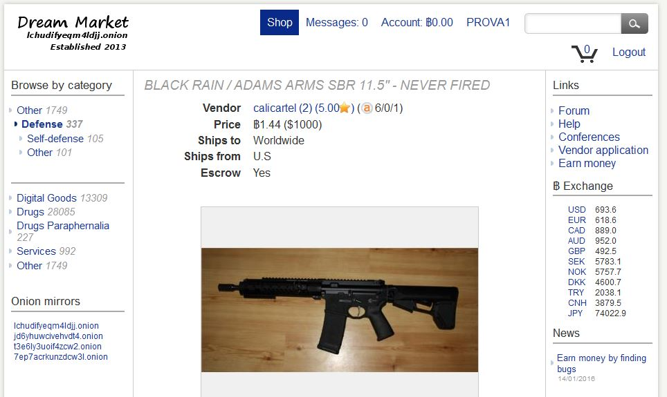

# Armi
---

Fanno parte di questa categoria tutti quei siti che sono dediti alla **compravendita di armi**.  
Uno dei più famosi è **The Armory**, nato nel 2012, sempre appartenente al fondatore di **Silk Road**, piattaforma focalizzata soprattutto sulla compravendita di droga; **The Armory** a causa della sua popolarità è stato oscurato dall'FBI e tuttora è inaccessibile. 

Tuttavia si possono riperire delle armi su moltissimi altri siti, si ha solo l'imbarazzo della scelta, uno di questi può essere **Dream Market** od anche lo stesso **Silk Road** (di cui parlerò successivamente).
 
