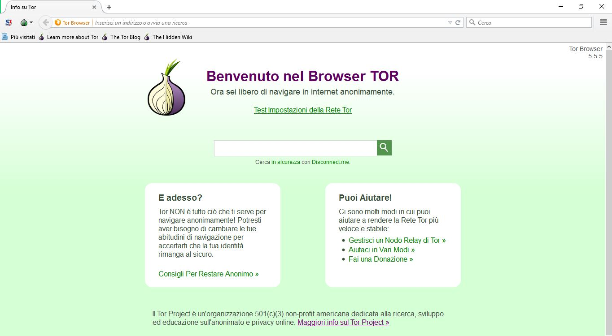
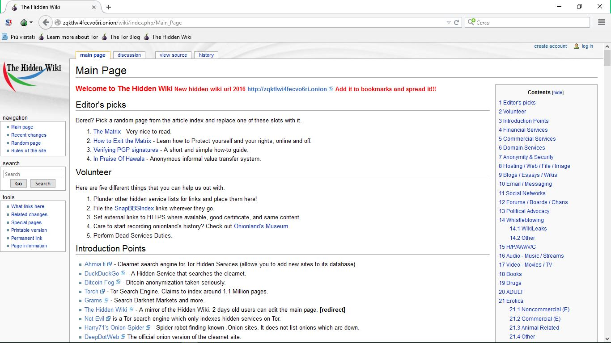

# Come accedervi
---

Abbiamo già detto che non è possibile navigare nel Deep Web tramite un normale browser come, per esempio, Chrome, Firefox,ecc. 
Per accedervi abbiamo bisogno di software "speciali", il più diffuso è **Tor browser**. 
 
Questo programma è semplicemente disponibile sul proprio sito [torproject.com](https://www.torproject.org/) nella sezione dei download. Al termine dell'installazione si aprirà una pagina simile a **Mozilla Firefox** (come illustrato qui sotto).  
  
Arrivati a questo punto non si è ancora nel **deep web**, per farlo si deve raggiungere il "cruscotto" di internet sommerso, chiamato "**hidden wiki**".  

Prima di tutto si deve copiare l'indirizzo:
 http://zqktlwi4fecvo6ri.onion/wiki/index.php/Main_Page  
dopo di che si aprirà una schermata che conterrà la **lista** dei **siti più rilevanti** appartenenti al **Deep web**.  

   
Ora si potrà **esplorare qualsiasi sito** che rientrerà nella hidden wiki. I link sono suddivisi in base alla tipologia del contenuto, che potrà appartenere ad una categoria comune come finanza oppure una più forte come droga, adult o armi.