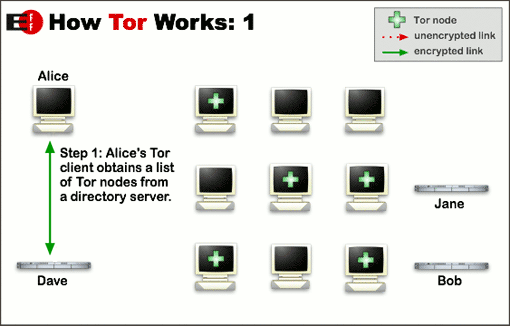
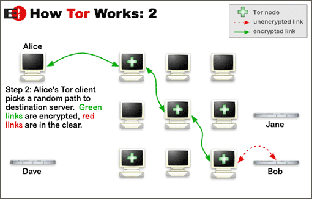
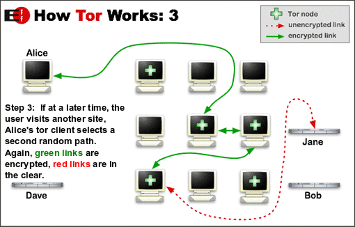

# Come funziona
---
La rete di Tor usa una topologia a maglia: ogni utente connesso consiste in un **nodo anche detto relay**. Un nodo può
anche fungere da **nodo di uscita (exit node, exit relay)**, ovvero prende i pacchetti originati da altri nodi e li spedisce al
reale destinatario fuori dalla rete Tor (ad esempio un sito web).

* Alice recupera la lista dei **nodi** della rete Tor da un **directory server**
* Alice si collega direttamente a uno dei **nodi** della rete Tor

* Il client Tor di Alice sceglie un percorso per raggiungere la destinazione dei dati
* I collegamenti **in verde** sono **crittografati** mentre quelli in rosso sono **non necessariamenti protetti**

* Quando dopo si sceglie un altro sito il percorso al cambiare
* Il percorso può cambiare in qualsiasi momento al fine di rendere ancora più difficile il tracciamento.

#Perché è sicuro ed anonimo

Quando un nodo decide di spedire un pacchetto fuori dalla rete:
* Calcola la strada necessaria per raggiungere un nodo di uscita
* Prende le **chiavi pubbliche** di tutti i nodi sulla strada in ordine
* **Crea un layer (strato) di crittografia per ogni nodo sulla strada verso l'uscita**, effettivamente incapsulando il pacchetto in numerosi strati
  * Da qui deriva il nome "Tor", che originariamente significava "*The Onion Router*" (l'instradatore a cipolla).

Quindi:
* A ogni **hop** (salto) nella rete, ogni nodo rimuove il proprio strato di crittografia. In questo modo si è certi che il pacchetto originale possa essere letto solo dal **nodo di uscita** e che il percorso del pacchetto **sia per forza quello stabilito in origine dal mittente**
* A partire dal momento dell'uscita di un pacchetto dalla rete Tor, esso non è più protetto dalla sicurezza della rete ma appare come originato dal **nodo di uscita** quindi l'identità del **nodo** mittente è sconosciuta.

Di conseguenza qualsiasi intercettazione di un pacchetto a metà strada del percorso nella rete Tor è inutile poichè:
* il pacchetto si trova **incapsulato in almeno uno strato crittografico**
* il mittente e il destinatario scritti nel** pacchetto intercettato** sono quelli delle **due estremità del singolo collegamento tra due nodi Tor**, non quelli dell'originale destinatario e mittente
* **solo l'exit node** sa chi è il vero *destinatario* del pacchetto
* **solo il nodo del primo hop** sa chi è il vero *mittente* del pacchetto 

**Attenzione** alle intercettazioni dal nodo di uscita alla destinazione finale del pacchetto:
* Il pacchetto si trova tra il **nodo di uscita** e la **destinazione finale**
* Il pacchetto **non è più incapsulato nella crittografia di Tor**
* Se il pacchetto **non dispone di ulteriori strati di sicurezza come TLS, OpenSSL o un sistema custom** allora:
  * Chiunque può leggere il pacchetto
  * *il* ***nodo di uscita*** *può* leggere *ed* alterare* il pacchetto*