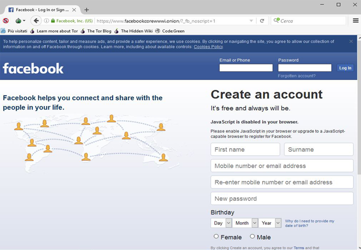

# Contenuto
---
Dopo uno studio tenutosi nel dicembre 2014 dall'università di Portsmouth, si è scoperto che il **contenuto più frequentemente richiesto** su Tor è la **pornografia infantile**, seguito dal **mercato nero**, mentre i siti con il più alto traffico sono quelli dedicati alle **botnet** (che successivamente spiegherò).  
Da notare l'alta difussione di siti riguardanti la **controinformazione**, come forum di discussione politica.  Infine siti più prolifici sono quelli associati ai **Bitcoin**, **frode** ed **E-commerce**. 
 
##Botnet
<.................... FOTO BOTNET............> 
Una botnet è una rete formata da dispositivi informatici collegati ad Internet ed **infettati** da malware, controllata da un'unica entità, il ***botmaster***.  
A causa di falle nella sicurezza o per mancanza di attenzione da parte dell'utente, i dispositivi vengono **infettati** da virus informatici o trojan i quali consentono ai loro creatori di **controllare il sistema da remoto**. I controllori della **botnet** possono in questo modo sfruttare i sistemi compromessi per scagliare attacchi distribuiti del tipo **distributed denial of service **(**DDoS**) contro qualsiasi altro sistema in rete oppure compiere altre operazioni illecite. I dispositivi che compongono la **botnet** sono chiamati **bot** (da roBOT) o **zombie**.

###Tabella illustrante la densità della tipologia dei siti
| **Categoria** | **percentuale (%)** |
| -- | -- |
| Violenza | 0.5|
| Armi | 0.8 |
| Social | 1.2 |
| Hacking | 1.8 |
| Pornografia illegittima | 2.3|
| Nexus| 2.5|
|Estremismo|2.7|
|Altri illeciti|4.1|
|Finanza|6.3|
|Droga	|8.1|
|Altro|19.6|
|Non accessibili|50.1|

###<u>Social<u/>
Si tratta per lo più di **comunità online** dedite al file sharing di materiale illecito simili a dei forum, esistono anche blog innocui; perfino **Facebook** ha un proprio sito .onion

È identico al **Facebook** che tutti conosciamo, l'unica cosa che cambia è **l'anonimato**, nel senso che i dati che inviamo ai server sono cifrati dalla rete tor, questo non vuol dire che **Facebook** non tenga traccia delle proprie pagine che visualizziamo. Tuttavia questo sito, in termini di **fluidità**, non è minimamente paragonabile al comune Facebook, questa **lentezza** è data dalla rete tor.