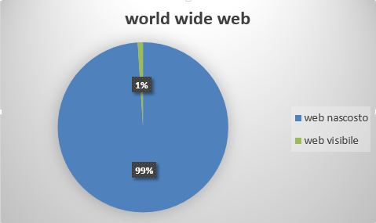

# Dimensioni

---
##Quanto è grande?
L' FBI, dopo alcuni studi, ha stimato che il web visibile contiene circa 19 terabyte di materiale, il deep web invece circa 7500 Terabyte, che corrispondono a 7,5 Petabyte (1 PB = 1*10^15B). Ciò significa che la parte nascosta di internet è circa 400 volte più grande di quello comune. 
Molti dicono che ora le dimensioni del deep web si misurino in zettabytes (1 ZB =$$1*10^{21} $$B), ma non c'è stato nessuno studio ufficiale, indi per cui non si può sapere se è un'informazione attendibile.  
