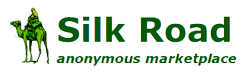
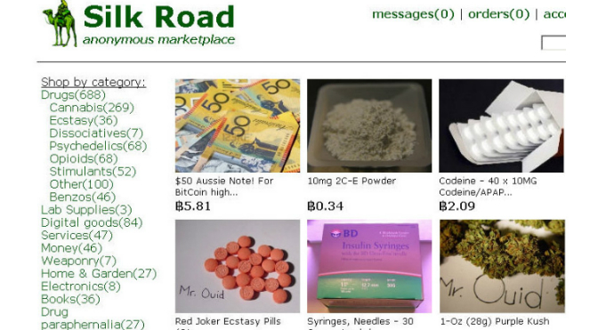
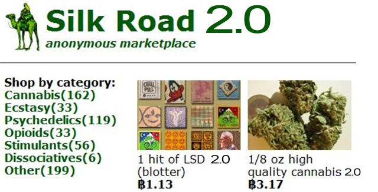
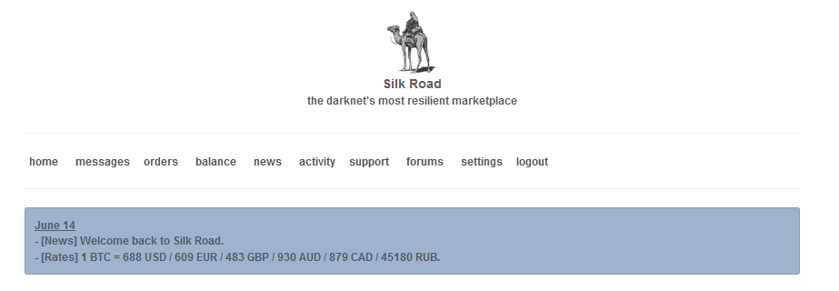
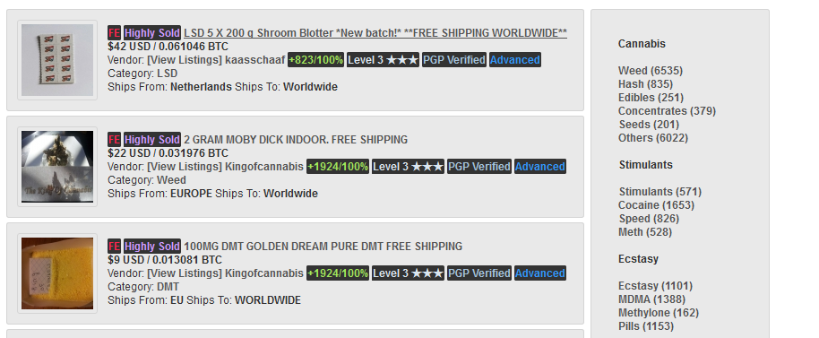

# Droga
---
a categoria illegale che ha la più alta densità di siti, contiene tutti quei black market che trattano o fabbricano droga, comprese anche medicinali ottenuti illegalmente tramite ricette false. 
Il Black market più famoso di tutti è **Silk Road**, protagonista di un'infinita lotta contro l'FBI che ha già oscurato la sua prima versione ed anche la 2.0 attualmente è online la versione 3.0 che non ha l'interfaccia grafica user-frendly come le precedenti, ma ottempera comunque il suo compito.

Il sito è stato lanciato per la prima volta nel 2011, dopo il grande successo che ha ottenuto, l'FBI nel ottobre 2013 l'ha oscurato, arrestando anche il fondatore **Ross William Ulbricht** detto "**Dread Pirate Roberts**". Nel novembre dello stesso anno, un mese dopo questa operazione, venne lanciato **Silk Road 2.0** successivamente oscurato solo nel novembre 2014.
 
###<u>Silk Road 1.0<u/>
    

###<u>Silk Road 2.0<u/>

###<u>Silk Road 3.0<u/>

&nbsp;&nbsp;&nbsp; *-Intestazione con barra dei menù.*

&nbsp;&nbsp;&nbsp; *-Merce sulla sinistra e categoria sulla destra.*