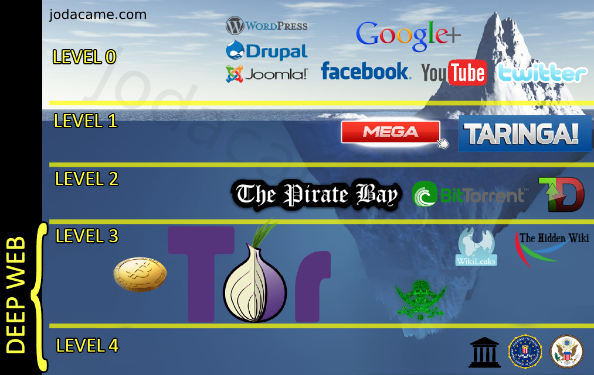

# Internet
---
###Definizione

Generalmente definita, Internet è la "rete delle reti", un insieme di computer sparsi in tutto il mondo collegati tra loro, a cui possono accedere migliaia di utenti per scambiarsi informazioni binarie di vario tipo.  
Tecnicamente la definizione più corretta di Internet è forse quella di una federazione o un insieme di reti in grado di comunicare utilizzando il set di protocolli TCP/IP.

###Suddivisione
Internet è diviso in vari livelli, ognuno con diverse caratteristiche.  
 
* **Livello 0 (Common web):** è quella parte di internet che usiamo tutti i giorni, ospita la maggior parte dei siti che conosciamo.
* **Livello 1 (Surface web):** dove operano i server informatici e siti come Reddit (sito Internet di social news e intrattenimento, dove gli utenti registrati possono pubblicare contenuti sotto forma di post testuali o di collegamenti ipertestuali).
* **Livello 2 (Bergie web):** ultimo livello accessibile senza particolari strumenti e conoscenze, ospita risultati nascosti di Google e siti di video e immagini senza censure.
* **DEEP WEB:**
  * **Livello 3 (Charter web):** dove si entra solo usando software speciali e dove si trovano i canali di comunicazione degli hacker, trafficanti di armi e droga, jihadisti, estremisti e pornografi. È il mercato nero del mondo.
  * **Livello 4 (Marianas web):** il suo nome ricorda la fossa delle Marianne. Si dice comprenda l'80% di internet. Il suo contenuto è in parte sconosciuto e fonte di leggende metropolitane.
