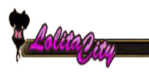

# Pornografia Illegittima
---
I siti che appartengono a questa categoria contengono materiale **pornografico** che coinvolge bambini, animali o materiale ottenuto senza il consenso dei partecipanti. 
Quello più famoso è **Lolita City**, questo sito pubblica immagini e video di pedo-pornografia con ragazzi e ragazze sotto i 17 anni come protagonisti.

Come i comuni siti di pornografia, **Lolita City**, dal novembre 2012, metteva a disposizioni diverse categorie che i "**fans**" potevano scegliere. Alcuni dei "**fotografi**" erano professionisti ed altri amatoriali.  
Nel giugno del 2013 il sito conteneva circa **1.4 milioni** di immagini pedo-pornografiche, con circa **15000 utenti** sparsi in tutto il mondo. 
Fortunatamente un gruppo di Hacker chiamati "**Anonymous**" si impose come obbiettivo l'estirpazione della pedo-pornografia dal web, in un primo attacco a **Lolita City** riuscirono a renderlo inagibile e pubblicarono circa 1600 username degli utenti. Successivamente con la messa offline della sito "**Freedom Hosting**", citato in precedenza, Lolita City ed altri circa 40 siti di pedo-pornografia sono ancor oggi inaccessibili.
