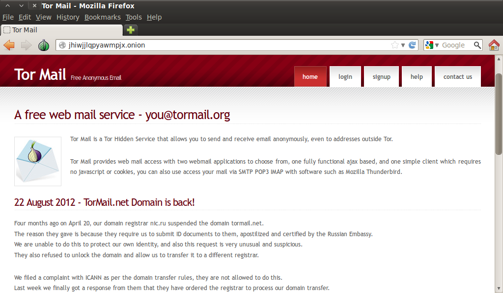

# Tor Mail
---
Tor mail è un servizio nascosto della rete, contenuto in tor sotto pseudo-dominio di primo livello ".onion", che si pone come obbiettivo quello di rendere completamente anonime e irrintracciabili le comunicazioni per gli utenti che usufruiscono del servizio.  
L'anonimato di tormail si basa su dei server monouso comprati anonimamente (freedom hosting).  
Al momento dell'iscrizione non è richiesto alcun tipo di dati personali in modo da non poter essere in alcun modo rintracciabili se terzi venissero a conoscenza dell'esistenza dell'account. 

 
##Freedom hosting